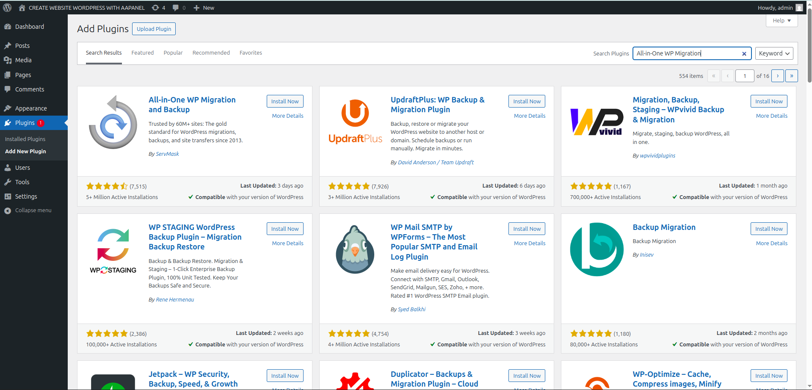
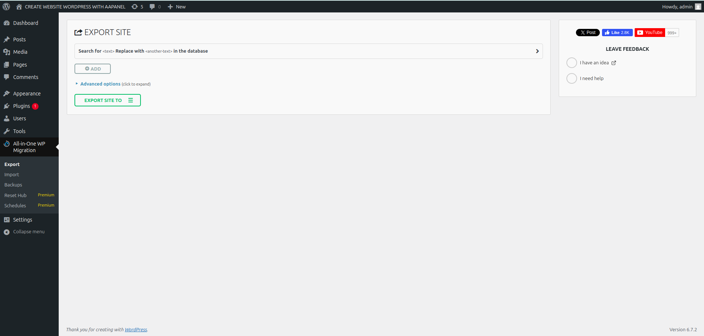
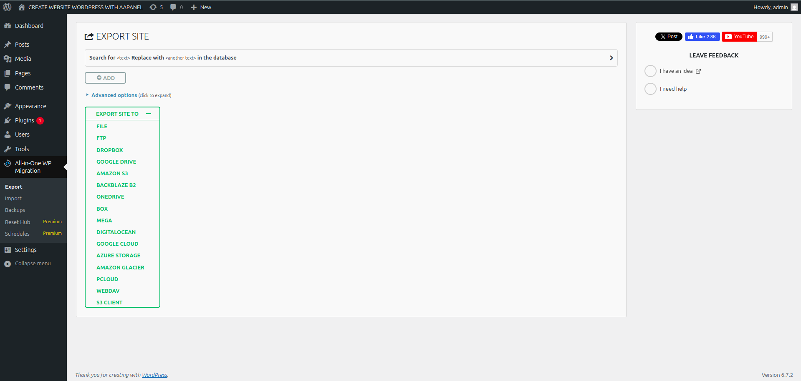
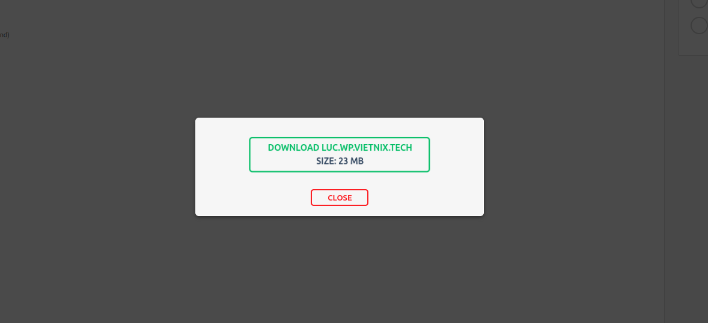
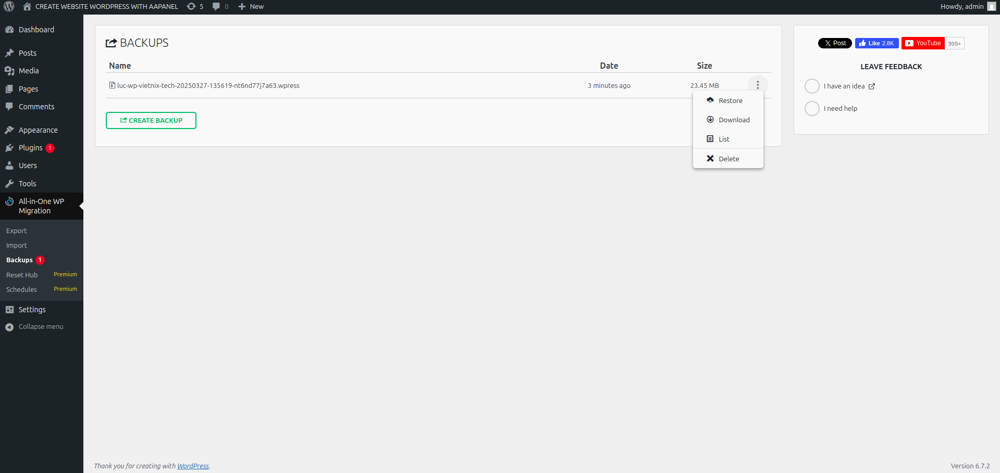
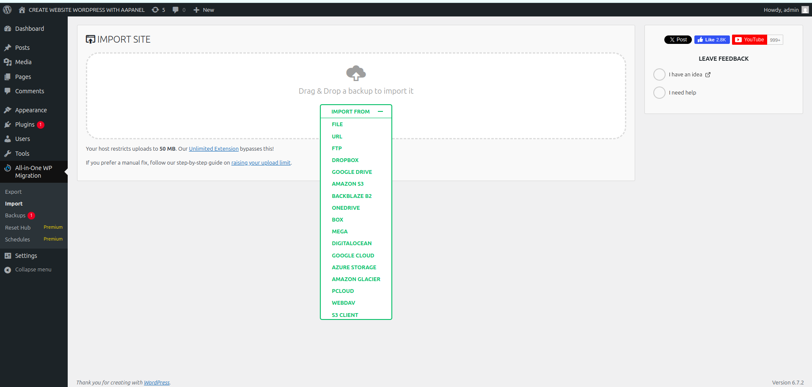
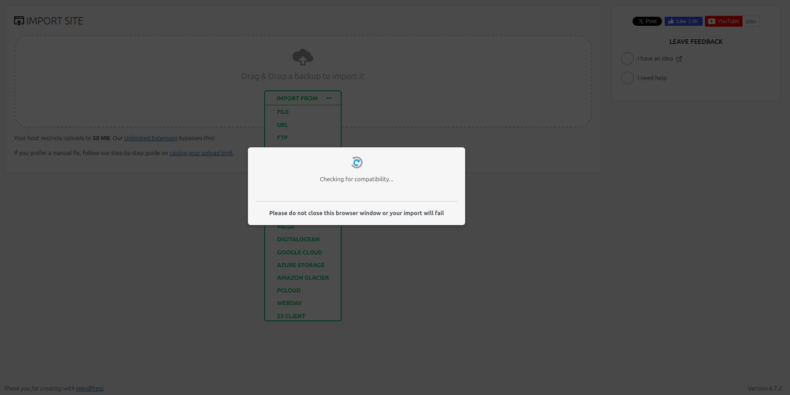

# Chuyển dữ liệu website WordPress bằng Plugin All-in-One WP Migration
- All-in-One WP Migration là một plugin rất phổ biến và mạnh mẽ dành cho WordPress, giúp người dùng dễ dàng di chuyển hoặc sao lưu toàn bộ dữ liệu website từ một nơi này sang nơi khác. Plugin này hỗ trợ di chuyển toàn bộ các yếu tố trong website, bao gồm:
    + **Cơ sở dữ liệu** (database)
    + **Các tệp tin media** (hình ảnh, video, tài liệu)
    + **Theme** (giao diện)
    + **Plugin** (tiện ích mở rộng)
    + **Các cài đặt** khác liên quan đến website
### Sao lưu dữ liệu website WordPress cũ
- Truy cập vào quản trị admin website WordPress để bắt đầu sao lưu (backup) dữ liệu: chọn `Plugins` → `Add New Plugin`.
- Search `All-in-One WP Migration` → `Install` → `Active Plugin`
#### 

- Sau khi kích hoạt thành công, vào Plugin `All-in-One WP Migration` → `Export Site To`.
####

- Tại `Export Site To` → `FILE` và chờ tiến trình sao lưu hoạt động (khoản 5 – 30 phút, tùy vào dung lượng website).
####

- Quá trình export file 
#### 

- Chọn `Close` để hoàn tất quá trình sao lưu toàn bộ dữ liệu trên website của bạn.
- Tại `Plugin All-in-One WP Migration` → `Backups` → `Download` để tải file backup về máy tính lưu trữ.
####

---
### Restore website từ file backup 
### Cách 1: Ta có thể backup ngay trên bản backup còn lưu trên plugin: trong `All-in-One WP Migration` → `Backup` → `Restore`

### Cách 2: Import file download mà ta đã download lúc backup về máy 
#### Bước 1: Trong `All-in-One WP Migration` → `Import` → `Import From` → `File` → Sau đó trở đến thư mục lưu file backup .wpress

#### Bước 2: Chọn `PROCEED` → `FINISH` để hoàn thành 

