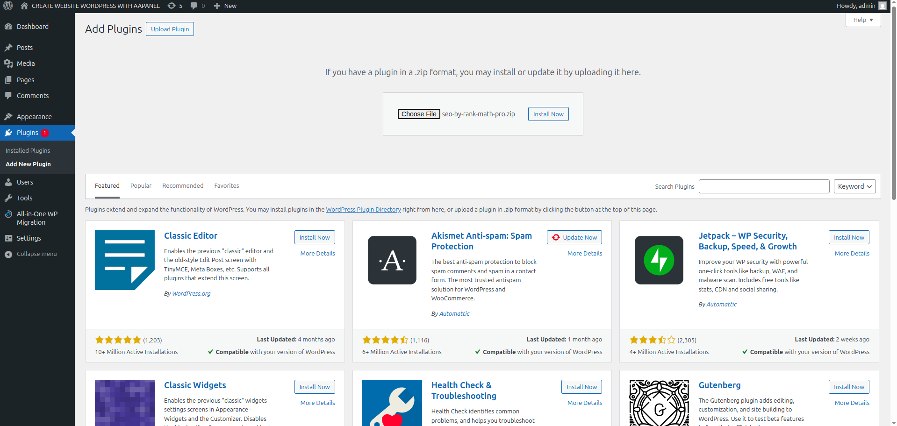
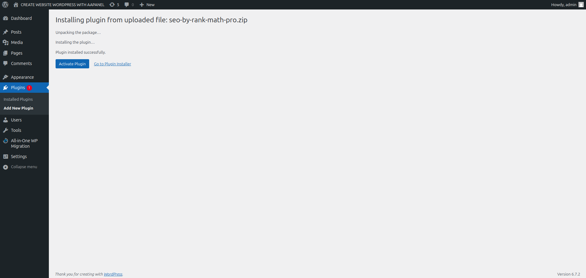

# Upload Plugin Rank Math SEO 
### Bước 1: Download plugin từ https://portal.vietnix.vn/index.php?rp=/download về máy(không giải nén vì lát sẽ upload file .zip lên).
### Bước 2: Vào `Plugin` → `Add New Plugin` → `Upload Plugin` →  sau đó trỏ tới đường dẫn chứa plugin vừa tải về  → `Install Now`.

### Bước 3: Đợi quá trình hoàn tất (có thông báo Plugin install successfully) rồi sau đó chọn `Activate Plugin`

### Tiếp theo cấu hình ban đầu Rank Math 

####
---
#### Các plugin khác cài đặt tương tự 
---
# Tìm hiểu về WP rocket và Litespeed Cache 
## 1. WP Rocket:
- Mục đích sử dụng: WP Rocket là một plugin tối ưu hóa hiệu suất cho website WordPress. Plugin này giúp tăng tốc độ tải trang web bằng cách tối ưu hóa bộ nhớ cache, tối ưu hóa tập tin CSS/JS, hình ảnh, và nhiều tính năng khác nhằm cải thiện trải nghiệm người dùng và SEO của trang web.
- Trường hợp sử dụng: WP Rocket thích hợp cho mọi loại trang web WordPress, đặc biệt là cho các trang web cần tối ưu hóa hiệu suất và tốc độ tải trang. Nếu muốn dễ dàng tối ưu hóa trang web mà không cần nhiều kiến thức kỹ thuật về tối ưu hóa, WP Rocket là một lựa chọn tốt.
## 2. Litespeed Cache:
- Mục đích sử dụng: Litespeed Cache là một plugin tối ưu hóa hiệu suất dành cho trang web chạy trên máy chủ web LiteSpeed. Plugin này cung cấp các tính năng tối ưu hóa cache, tối ưu hóa hình ảnh, tối ưu hóa CSS/JS, và nhiều tính năng khác để cải thiện tốc độ tải trang web.
- Trường hợp sử dụng: Litespeed Cache thường được sử dụng trên các trang web chạy trên máy chủ LiteSpeed Web Server. Nếu trang web hoạt động trên máy chủ LiteSpeed, việc cài đặt Litespeed Cache sẽ giúp tối ưu hóa hiệu suất của trang web một cách hiệu quả. Plugin này cung cấp tính tích hợp tốt với máy chủ LiteSpeed và nhiều tính năng mạnh mẽ để cải thiện tốc độ và hiệu suất của trang web.
## Khi nào có thể sử dụng Litespeed Cache:
- Có thể cài đặt Litespeed Cache khi trang web của đang hoạt động trên máy chủ LiteSpeed hoặc khi đang sử dụng dịch vụ hosting hỗ trợ LiteSpeed Web Server. Plugin này sẽ giúp tối ưu hóa hiệu suất trang web một cách hiệu quả khi hoạt động trên môi trường LiteSpeed.