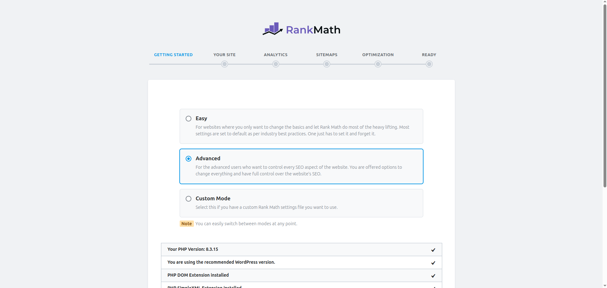

# Upload Plugin Rank Math SEO 
### Bước 1: Download plugin từ https://portal.vietnix.vn/index.php?rp=/download về máy(không giải nén vì lát sẽ upload file .zip lên).
### Bước 2: Vào `Plugin` → `Add New Plugin` → `Upload Plugin` →  sau đó trỏ tới đường dẫn chứa plugin vừa tải về  → `Install Now`.

### Bước 3: Đợi quá trình hoàn tất (có thông báo Plugin install successfully) rồi sau đó chọn `Activate Plugin`

### Tiếp theo cấu hình ban đầu Rank Math 

####
---
#### Các plugin khác cài đặt tương tự 
---
